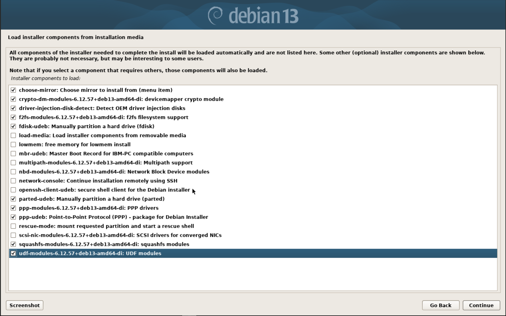
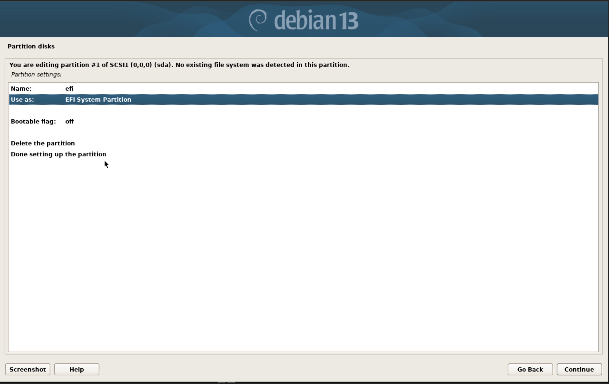
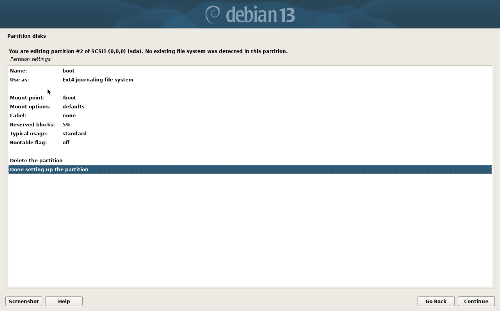
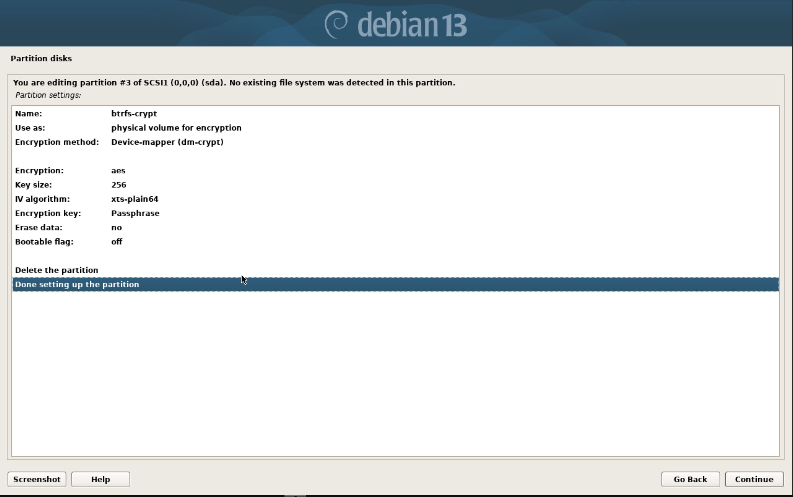
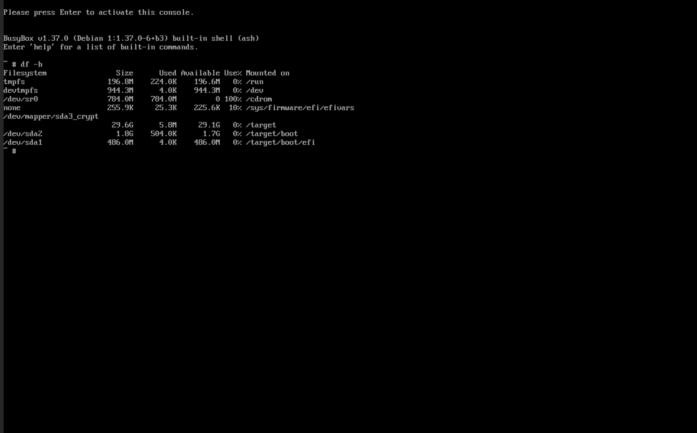

+++
title = "custom debian installation"
date = "2025-12-08T13:25:31-06:00"
author = "alex mcculley"
authorTwitter = "" #do not include @
cover = "/img/Debian.jpg"
coverCaption = ""
tags = ["os", "linux", "workstation"]
keywords = ["debian", "linux"]
description = "Customizing old faithful"
showFullContent = false
readingTime = false
hideComments = false
color = "" #color from the theme settings
+++

# overview
I like btrfs. One of the main reasons I choose btrfs as a filesystem is for backup tools like snapper and timeshift. With these tools, your system is much more resilient to breaking on you since you can simply roll back to a previous snapshot! Besides the snapshots, I like the compression, the CoW filesystem, the list goes on. Unfortunately when it comes to installations, most distros make it a little frustrating to get the setup *exactly* how I want it. Not impossible but frustrating. While I love NixOS for it's immutability, IaC approach, and stability, I also love Debian. It's ole reliable in my eyes. The granddaddy of Linux distros. It's your favorite Linux distribution's favorite Linux distribution. For that reason, I wanted to document the process it takes to get my preferred setup which includes:
- UEFI boot
- Separate boot partition
- Passphrase encrypted LUKs container with BTRFS as filesystem
- Separate subvols for:
	- /root
	- /home
	- /var/log
	- /snapshots
It should be noted that this is my preferred installation for a desktop installation or if I was running Debian bare-metal. If it were a bare metal server I might try to configure a device for unencrypting the drive at boot for unattended reboots. I tend to not care *as much* about encryption on servers that are housed behind physical access controls. I personally think that encryption is an absolute necessity for laptops, and as a side note I think it's criminal for Microsoft to not allow for encryption on Windows Home versions. For VMs, I keep things a little simpler and make the host filesystem btrfs and the VM gets EXT4. If you're curious on that, I wrote a blog post on it for the hackerspace I'm trying to get running [here](https://sodakhacker.space/projects/vm-template/).

## installation 
We'll boot into Debian stable and go with 'Advanced Options' -> 'Expert Graphical Install'. Then we'll walk through that, setting the language and keyboard layout. Once we hit the 'Load Installer components from installation media' we'll hit quite a few of these components. To be honest, we probably don't need all of these, but we'll just add some additional ones to be safe. 



From the main menu, we'll detect the network devices and configure that to whatever our network setup is. We'll select a mirror of the Debian archive, I recommend whatever is physically closest to you, and setup users and passwords as needed. After clock configuration, we move into the disk detection and setup. This is where the magic happens. 

### disk partitioning
First we select 'Manual' under disk partition and configure a new partition table in `gpt` by selecting our disk we want to install Debian on. Once we have the partition table setup, we select the free space and create a 512MB partition for EFI and configure it as such:



After that we create a 2GB partition, format it as EXT4 and mount it at `/boot`. Again we select the `FREE SPACE` to do so.



With that out of the way, we move into our LUKS partition. We select 'Configure encrypted volumes' at the top of the menu. Confirm writing the partitions we have configured so far. Then select 'Create encrypted volumes' and select the free space on our drive. Give it a name, and choose to erase the data or not. It may take a while but it is best practice. 



After that write the changes and configure the encrypted volumes. From the main encryption drive menu select 'Finish'. This will prompt for a passphrase on the partition. Once this is finished, we get dumped back at the main disk partition menu. We now have an additional option at the top of our partition menu that allows us to configure the unlocked LUKS container. We'll need to configure that for btrfs by selecting the new entry and mount it at root. We'll select the 'Finish partitioning and write changes to disk' option at the very bottom and then move into the console. Your partitions should look something like this before selecting 'Finish partitioning and write changes to disk':


You'll get an error stating that there's no swap partition. You can either add one within the LUKS container or you can configure zswap or have no swap. That's up to you.

**Note, if you didn't select expert install the installer will automatically install the base system. This isn't ideal because we haven't configured the subvols yet.**

### enter the shell
Now we move into a console by hitting `Ctrl+Fn+Alt F2`. This will dump us into a busybox shell. We can see where things are mounted with `df -h`. We can see that currently our btrfs partition is mounted at `/target`. However, this is actually the root subvol mounted. We need to unmount `/target`, `/target/boot`, and `/target/boot/efi` to continue. 




```bash
umount /target/boot/efi
umount /target/boot
umount /target
```

Now we mount the unlocked luks container partition with:

```bash

mount /dev/mapper/sda3_crypt /target
cd /target
```

We can see the root subvol given the name `@rootfs`. We'll just change that to `@` and create our new subvols:
```bash
mv @rootfs @
btrfs subvol create @home
btrfs subvol create @snapshots
btrfs subvol create @var_log
```

With our subvols created, we can remount our root subvol, create proper directories to mount the additional subvols, and remount our boot and efi partitions. 

```bash
umount /target
mount -o noatime,space_cache=v2,compress=zstd,ssd,discard=async,subvol=@ /dev/mapper/sda3_crypt /target
mkdir -p /target/home /target/var/log /target/snapshots
mount -o noatime,space_cache=v2,compress=zstd,ssd,discard=async,subvol=@home /dev/mapper/sda3_crypt /target/home
mount -o noatime,space_cache=v2,compress=zstd,ssd,discard=async,subvol=@snapshots /dev/mapper/sda3_crypt /target/snapshots
mount -o noatime,space_cache=v2,compress=zstd,ssd,discard=async,subvol=@var_log /dev/mapper/sda3_crypt /target/var/log
mount /dev/sda2 /target/boot
mount /dev/sda1 /target/boot/efi
```

After mounting all the subvols and partitions, your output of `df -h` should look like:


Once that's been verified we can move into modifying `/target/etc/fstab` with `nano`. We can copy lines with `Alt + 6` and `Ctrl + U`. Don't forget to add the mount options to take advantage of some of the features of btrfs:


In case you're curious on what each mount option does:

- `noatime` - This option doesn't update the last accessed time on a file when it's read. Doing that creates a write on the file and isn't needed on SSDs or NVME drives.
- `space_cache=v2` - Sets the space cache (which is how btrfs knows what parts of the disk are free) to be version 2, the more modern option. 
- `compress=zstd` - Sets compression algorithm to `zstd`. It's a good compression algorithm that doesn't take a lot of CPU overhead.
- `ssd` - Sets btrfs to behave in a way best suited for ssds. Technically it should detect this by default. 
- `discard=async` - Sets TRIM (the operation of erasing storage blocks) to be async allowing those operations to be pooled and performed in the background. If not set properly can lead to weird system pauses. 
- `subvol=@` - Mounts the appropriate subvolume in the right location.

Double check that these entries are correct - otherwise you won't have a bootable system. Once that's done, we can move back to the gui installer and install the base system with `Ctrl+Fn+Alt F5`. At this point, the hard part is over. I select the defaults for the kernel installation generic kernel module stuff. Once that step is done, you can continue to install a DE if you'd like. And that's it! Boot into your system and enjoy an encrypted btrfs Debian system! 
