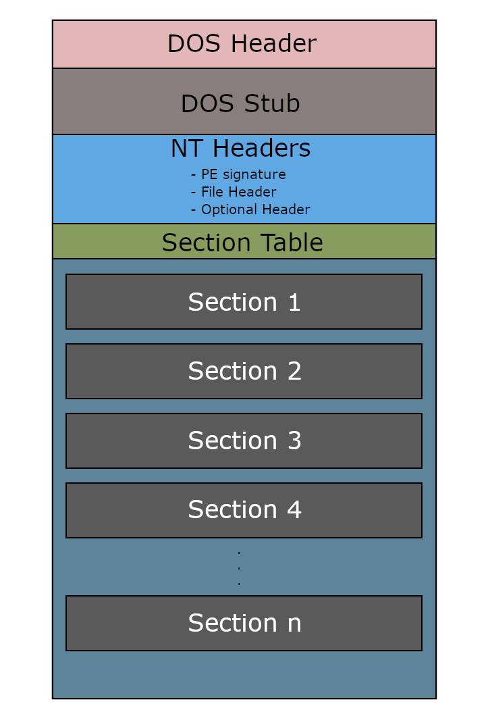
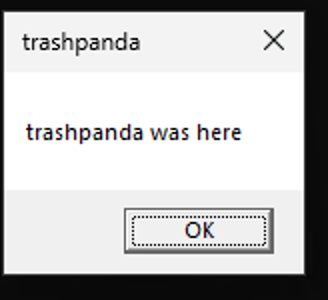
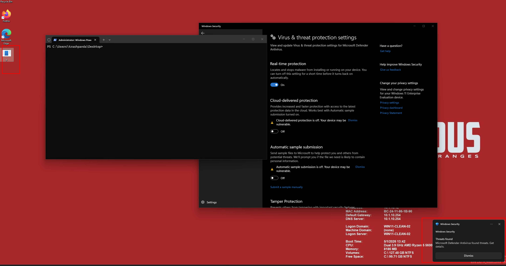
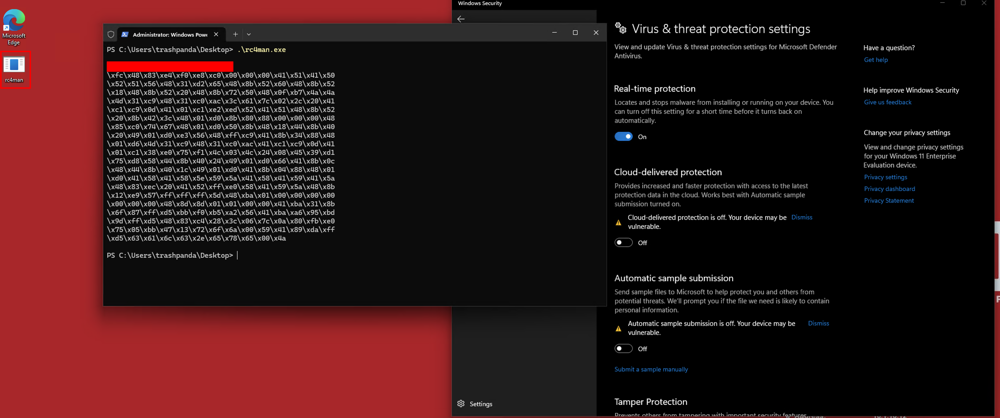
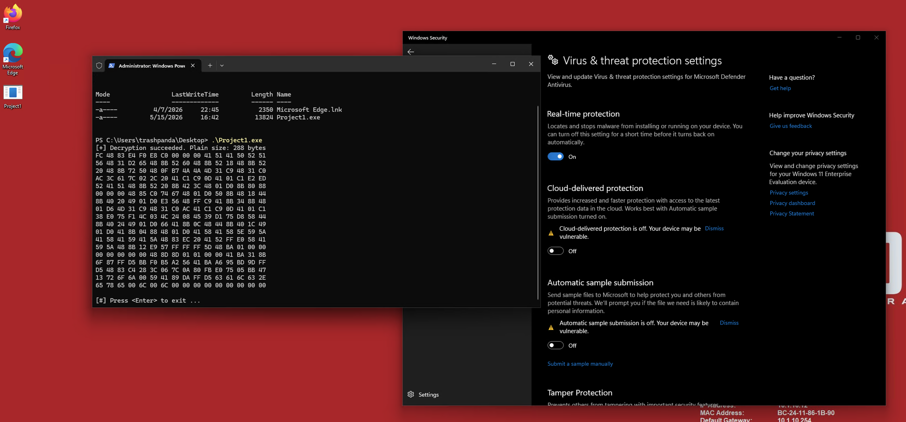

+++
title = "malware development studies (pt. 1)"
date = "2026-05-20T00:00:00-05:00"
author = "alex mcculley"
cover = ""
coverCaption = ""
tags = ["malware-development", "windows", "offensive-security"]
keywords = ["malware development", "windows", "win32api", "pe format", "shellcode", "rc4", "aes", "xor"]
description = "diving back into the low level depths"
showFullContent = false
readingTime = false
hideComments = false
color = "" #color from the theme settings
Toc = true
aiDisclaimer = true
+++

I've been studying malware development recently in an effort to understand Windows at a low level and begin working more on that side of offensive operations. It's a shift from my typical world of network penetration testing that I've been living in, and has necessitated me using 100% of my brain. As a way of keeping myself motivated and solidifying my understanding I wanted to write up some blog posts as I've moved along in my coursework.

## pe structure

The Portable Executable (PE) file format is crucial to understand for this work. PE files are native executables for Windows (think EXEs and DLLs). Breaking down the PE structure allows us to start talking about payload placement and permissions on sections of the PE where data is stored (more on that later). Here's a few of the parts of a PE structure worth noting (non exhaustive for brevity):

- DOS Header - first part of a PE. It's a struct that first contains the magic bytes 'MZ' letting the system know we're working with a PE file.
- Data Directories - An array of structs that each contain a `Size` and `VirtualAddress` that point to tables.
- Sections - PE content that I've worked the most with so far. This contains things like the `.text`, `.rsrc`, `.data`, and `.rdata` sections. Each has its own permissions which has interesting implications for payload placement.

One way that I've thought about PEs is that it's like a low level database where headers are like metadata and schema, data directories act as an index/lookup table, with each entry pointing to specific "tables" of information scattered throughout the sections. The sections themselves are the actual data storage.

The windows loader doesn't read the file linearly but instead follows pointers and offsets to data that gets placed into memory.



## win32api

Inside the PE are calls to the Win32API. This is what lets programs interact with Windows as an operating system both in userland and - through layers of DLLs - in the kernel space. Win32API is one of those 'I'm always going to be learning' type things. There are a ton of data types defined by the windows api and to add to the complexity some of the windows API calls are undocumented (because proprietary software).

Something I've learned poking at the windows api and reading older malware development docs is that it's much tougher to successfully bypass the windows api and make direct syscalls than it used to be. EDR vendors have hooks into `ntdll.dll`, meaning they have a `jmp` instruction to intercept syscalls made through legitimate means. Direct syscalls are checked to see if they come from legitimate sources like `ntdll.dll`. When the return address isn't within `ntdll.dll` it raises suspicion.

As an example, I can walkthrough a simple win32api call - MessageBoxA. Per the [MSDN](https://learn.microsoft.com/en-us/windows/win32/api/winuser/nf-winuser-messageboxa) here's the call:

```c
int MessageBoxA(
  [in, optional] HWND   hWnd,
  [in, optional] LPCSTR lpText,
  [in, optional] LPCSTR lpCaption,
  [in]           UINT   uType
);
```

The first thing I do when I see a win32api call is make sure I understand the datatypes fed into the call. In this example we have:
- `HWND` - Handle (like opening a door to an object) to an 'owner window' in the graphical sense. In this instance it's like a parent process but for graphical windows.
- `LPCSTR` - Stands for Long Pointer to Const String. an immutable character string that will display the message in the window (`lpText`) and the title (`lpCaption`).
- `UINT` - Unsigned int that will display the user's options they can click.

With all that in mind we can use the following code to display a simple text box to the user:

```c
#include <windows.h>

int main() {

	LPCSTR lpText = "trashpanda was here";
	LPCSTR lpCaption = "trashpanda";

	MessageBoxA(NULL, lpText, lpCaption, MB_OK);

	return 0;

}
```

`NULL` means that there's no parent window. `MB_OK` displays only an `OK` option for the user to click. It'll display the following when run:

<div style="display:flex; justify-content:center;">
  
</div>

Neat! Most win32api calls are not this simple. Sometimes they contain structs within structs or additional data types that are oddly named or a type that I've never seen before. It's a constant learning process. One of the neat things that we could do with the message box is create trollware - where things like `OK` don't close the window. Funny to think about - haven't done it yet.

## payload placement

In the context of the PE structure so far I've examined the following locations for payload placement:

- `.text`
- `.rdata`
- `.rsrc`
- `.data`

`.text` has executable permissions for shellcode stored in it. `.rsrc` can store larger payloads since it's technically stored by reference inside the PE. `.data` and `.rdata` allow for storing the shellcode in the PE although you'll need to set executable permission in `.data` specifically. The downside to `.text`, `.data`, and `.rdata` is a storage constraint. Larger payloads aren't going to fit into these sections, making it a good landing place for loaders or stagers (Although you could also just write a full fat exe to do the same work). Another consideration is detection noise. Storing payloads in the `.data` or `.rdata` is the noisiest. Since `.text` contains executable code it's less suspicious but also we're talking about malware so the normal opsec considerations apply there.

## payload encryption

Encrypting payloads requires walking a fine line. Encryption helps mask your payload from static detection but can increase entropy which is also a detection risk. In my studies I've looked at encrypting via `XOR`, `RC4`, and `AES`. `XOR` is the simplest route. While not an encryption algorithm technically (it's an operation that stream ciphers use) the main idea is that it flips bits according to a key. Performing the XOR operation with the same key against the encrypted payload will decrypt it (much like `RC4`, except you have to reinitialize the context in `RC4`). Playing around with simple `XOR` encryption (re `msfvenom` payloads) - it got blown away by defender. The same cannot be said for `RC4`.


Unsuccessful simple XOR attempt

`RC4` is also a symmetric stream cipher and unlike `XOR` I actually had some success with `RC4` and not just having the encrypted payload sitting on disk but also printing the shellcode to stdout! That confirms that the decryption works and evades detection which is a precursor to execution. Both a more manual RC4 method as well as using the WinAPI call `SystemFunction032` allowed for the payload to sit on disk and print to stdout.


Success with RC4!

AES is a block cipher and because of that the data to be encrypted needs to be in blocks of 16 bytes. If it's not, then padding is required to make it work. AES also involves modes like CBC, ECB, etc. I don't want to go too deep into the weeds on specifics. What I learned is that the easiest way to perform AES encryption is through the bcrypt library in windows. The code to perform it followed a few steps and was significantly more complex than RC4 or XOR. AES also succeeded in surviving on disk and printing to stdout:



## payload obfuscation

There's a lot of different ways to obfuscate a payload and they all follow a similar path. First you write a function that converts your shellcode into chunks of whatever format you want (ie IPv4) and store it in an array. You then take your fully obfuscated shellcode and place it into a loader to be deobfuscated in a separate program. Some EDRs may see storage of a large amount of IPv4 addresses or whatever else in a PE as suspicious. With your shellcode stored in an obfuscated manner, you need to include a way to deobfuscate that shellcode in your malware. The upside is that Windows ships ways to deobfuscate some formats into bytes (ie `RtlIpv4StringToAddressA`). This means that because it's a legitimate windows call performing the deobfuscation, your shellcode has a higher chance of survival. But even with that in mind, if the shellcode is well signatured EDRs may blow up your process. This also can burn you since certain EDRs will run your PE in a sandbox and quarantine/ delete it if they see raw shellcode.

Although obfuscation is weak by itself, it can actually help to *lower* entropy created by encryption. Encrypting a payload and then obfuscating it gives the payload a good chance of survival on disk. Note that it's not a catch all. There's a good chance it blows up even with encryption and obfuscation due to sandbox analysis.


## conclusion

Working with C is something that I'm still getting used to, but I'm starting to grasp some of the ideas about using it in conjunction with the Win32API. I just have to keep telling myself that C treats everything like numbers and data types are contracts with the compiler about how to treat those numbers. An `int` is a number that's an integer. A `char` is a number that's a character. A pointer is a number that has a job to point to an address in memory. It's different than the Fischer-Price Python world I'm used to, but the control is worth the effort. Everything to this point has been malware fundamentals. Shellcode that lives in a PE and needs to avoid detection. After I finish local payload execution (which may or may not survive stock Windows Defender - we'll see) I'll move onto the more advanced techniques like network loaders and living in memory. That's where the real wizardry begins.
