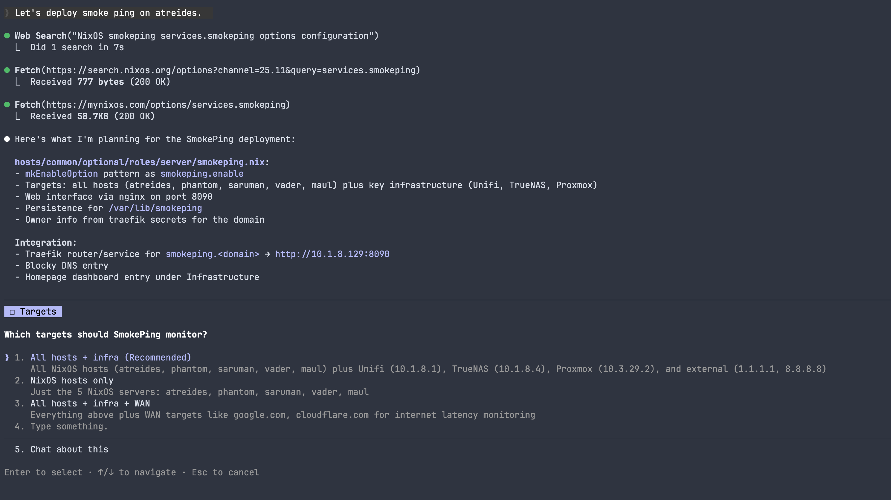
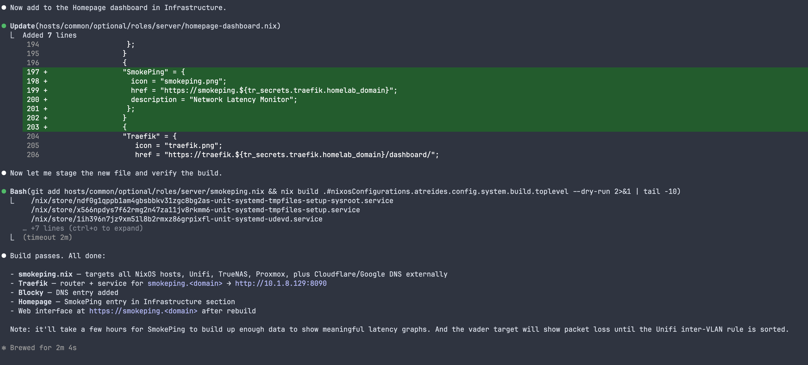
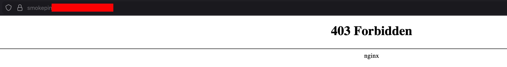
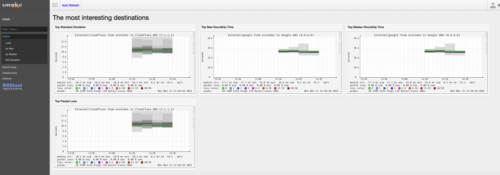

+++
title = "using ai to manage my nix configs"
date = "2026-03-23T00:00:00-05:00"
author = "alex mcculley"
cover = ""
coverCaption = ""
tags = ["ai", "nix", "homelab"]
keywords = ["ai", "nix", "nixos", "claude"]
description = "Using CLAUDE.md to wrangle AI into following my NixOS configuration schema"
showFullContent = false
readingTime = false
hideComments = false
color = "" #color from the theme settings
Toc = true
aiDisclaimer = true
+++

**Repository Link: https://github.com/mcculleytech/nixos-config**

## overview

My homelab is 90% NixOS and all the configuration is available on GitHub. I've structured the service configurations in such a way that I can just toggle them on and off in the main host configuration file. Each service config includes a toggle and the additional configuration to apply if said toggle is enabled. I like this configuration and while it's not fully implemented in my repo (with Claude's help it will be soon), it's the structure I want to roll with moving forward with any new service.

The only problem is that Claude may or may not produce this format when I instruct it to deploy a new service or I might have to specify it every time in order to get consistent results. Enter CLAUDE.md.

## the solution

The CLAUDE.md file allows us to give more context surrounding our project. We can specify tests to run, integrations that need to be implemented, and in our instance specify conventions that our project follows. I can tell claude via the CLAUDE.md file to utilize a template located at `templates/services.nix` to deploy new services and to place it in a specific location.

```
...

## new deployments
- For new service deployments, utilize the file `service.nix` as a template. By default place the new service under `optional` subdirectory for servers unless the configuration appears to be more desktop related in which case verify with the user on location. Reference the nix documentation for the specific service at `https://search.nixos.org/options?channel=25.11&query=<service>` and ensure all the necessary options are set for the service to run properly and are network accessible over the LAN (and tailscale) as well as via a reverse proxy (traefik). Once you have a configuration planned, present it to the user for approval before writing the file.
- Once you have the service file written, add the file to the `imports` section into the `default.nix` file for the `optional` subdirectory and enable the service on the host specified in prompt. If no host is given, prompt the user.
- Make an entry in the traefik `dynamic-config.nix` file. Creating entries for both `router` and `service` entries.
- Make a dns entry for the new service in the `blocky.nix` configuration file.
- Make an entry in the `homepage-dashboard.nix` file for the newly created service under the section that makes most sense. Verify with user before writing and provide reasoning.
- When adding persistence directories for services, use the attrset form (`{ directory = "..."; user = "..."; group = "..."; }`) with the service's user/group to ensure correct ownership on impermanence bind mounts.

## impermanence
- All hosts use impermanence with a blank root btrfs subvol snapshot. Persistent state lives under `/persist`.
- When a service requires subdirectories inside its state directory (e.g., `/var/lib/foo/data`), impermanence will bind-mount the parent directory but won't create subdirectories. If the service's pre-start script expects them to exist, it will fail.
- Fix this by adding `systemd.tmpfiles.rules` to create the required subdirectories before the service starts, e.g.: `"d /var/lib/foo/data 0755 foo foo -"`.
- Always check a new service's logs after first deploy — a crash loop with "directory does not exist" errors is a sign of this issue.
...
```

You can see that I provide it a detailed explanation about writing the new service, where to find options on configuration, integrating it in my traefik config, and how to make a nice entry under my homepage-dashboard instance. I also give it instructions for issues with impermanence and configurations. By using this method we can ensure that our particular Nix code schema is more likely to be followed and stay in line with other pre-configured services. Our CLAUDE.md file isn't just context for the agent to use, it's guardrails against configuration drift introduced by AI deciding it wants to take matters into its own hands.

## claude in action

It also gives us a superpower. We can now (in theory) deploy system services in one line of natural language. To test this I decided to deploy smokeping in my network. All I typed was "Let's deploy smokeping on atreides." and claude got to work developing a plan and asking questions when needed:



And after 2min and 4sec, we get an initial config and an edited blocky and traefik config ready to deploy:



### the reality

But after a quick rebuild, we get hit with a 403 from our smokeping instance:



It took another minute or two and a quick redeploy to get it working. Not quite a one-shot. Part of it was my own setup with impermanence and the directory being created but not set quite right. All in all about a 5min process. Still a substantially shorter amount of time than what it would take me manually. It also input my email into the configuration which I had it remove. A good reminder to review before you push the commit. Here's the working final product:



And here's the final smokeping configuration, and as you can tell it matches other services in our repository!

```nix
{ config, lib, ... }:
let
  tr_secrets = builtins.fromJSON (builtins.readFile ../../../../../secrets/git_crypt_traefik.json);
in
{

  options = {
    smokeping.enable =
      lib.mkEnableOption "enables SmokePing network latency monitor";
  };

  config = lib.mkIf config.smokeping.enable {

    services.smokeping = {
      enable = true;
      host = "0.0.0.0";
      hostName = "smokeping.${tr_secrets.traefik.homelab_domain}";
      owner = "alex";
      webService = true;
      targetConfig = ''
        probe = FPing
        menu = Top
        title = Network Latency Monitoring

        + NixOS
        menu = NixOS Hosts
        title = NixOS Hosts

        ++ atreides
        menu = atreides
        title = atreides (10.1.8.129)
        host = 10.1.8.129
        ...
<SNIP>
		...
      '';
    };

    # smokeping uses nginx for web interface; override listen port and serverName for traefik
    services.nginx.virtualHosts.smokeping = {
      serverName = "_";
      listen = [
        { addr = "0.0.0.0"; port = 8090; }
      ];
    };

    networking.firewall.allowedTCPPorts = [ 8090 ];

    systemd.tmpfiles.rules = [
      "d /var/lib/smokeping/data 0755 smokeping smokeping -"
      "d /var/lib/smokeping/cache 0755 smokeping smokeping -"
    ];

    environment.persistence = {
      "/persist" = {
        hideMounts = true;
        directories = [
          { directory = "/var/lib/smokeping"; user = "smokeping"; group = "smokeping"; }
        ];
      };
    };
  };

}
```

## closing thoughts

Working with my Nix configuration utilizing claude code taught me an important lesson. The way to combat the indeterminate nature of AI is to provide specificity and if possible templates for it to fill in data. The code itself is always only half the battle, the architecture and the decision making behind the code is the other half. Without a guiding hand we risk [the normalization of deviance in AI](https://embracethered.com/blog/posts/2025/the-normalization-of-deviance-in-ai/).

With that being said there's a beautiful irony to using something as indeterminate as AI to manage something as rigidly determinate as Nix configs. There's a push and a pull kind of vibe to it. A natural asymmetry that feels right.

It's funny, this repository has been around for years and represents hours of manual work and research before AI was a viable collaborator. I was hesitant to let it touch my project because it was mine. And while it's still a little weird to have AI making meaningful commits, I feel better having made the template and wrestling the AI to follow my lead.
